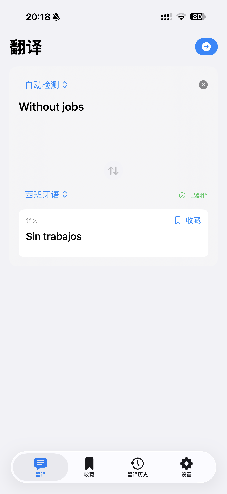
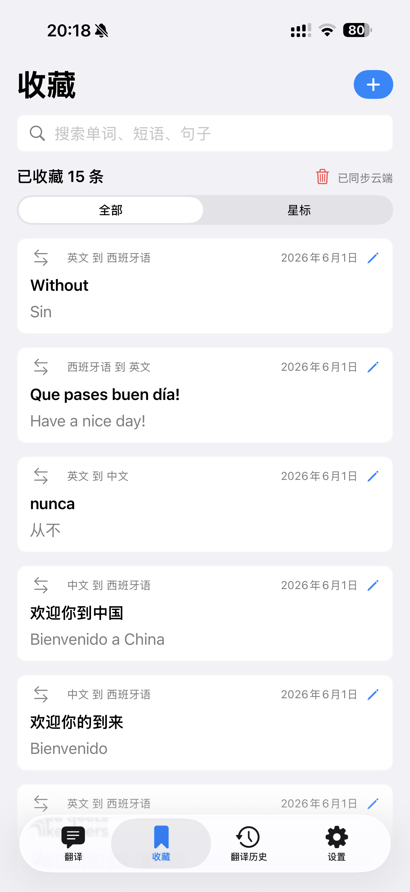
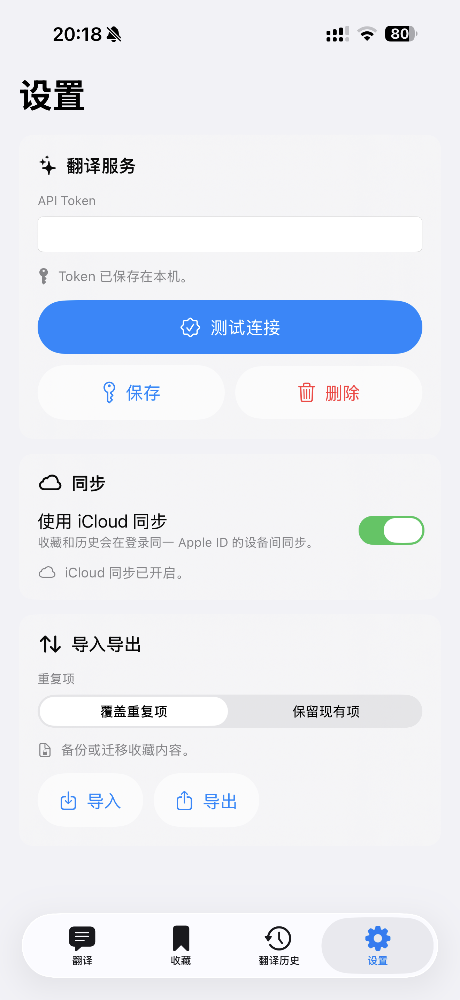

# WordScene

WordScene is a native multilingual translation and phrase-memory app for iPhone, iPad, and Mac. It combines streaming AI translation with a searchable personal library, translation history, a Share Extension, and optional iCloud synchronization.

The app is currently configured for the DeepSeek OpenAI-compatible API and supports automatic source-language detection plus 18 target languages.

## Highlights

- Native SwiftUI apps for iOS, iPadOS, and macOS
- Streaming DeepSeek translation with structured output, retry handling, and user-facing error states
- Automatic source-language detection and 18 translation targets
- Searchable phrase library with favorites and translation history
- Share Extension for translating selected text or shared URLs
- Clipboard-aware translation prompt
- Local persistence with import and export
- Optional CloudKit synchronization across Apple devices
- API credentials stored in Keychain
- Localized interface and platform-specific adaptive layouts
- Unit and UI test coverage for the core translation, persistence, navigation, and settings flows

## Screenshots

| Translation | Library | Settings |
| --- | --- | --- |
|  |  |  |

## Requirements

- macOS 15 or later for the Mac app
- iOS or iPadOS 18 or later for the mobile app
- Xcode 26.5 or later
- [XcodeGen](https://github.com/yonaskolb/XcodeGen)
- A DeepSeek API key
- An Apple Developer team and iCloud container if you want to use signing, CloudKit, push notifications, or the Share Extension on a physical device

## Build from Source

1. Clone the repository.

~~~sh
git clone https://github.com/jjhhyyg/WordScene.git
cd WordScene
~~~

2. Install XcodeGen if it is not already available.

~~~sh
brew install xcodegen
~~~

3. Generate the Xcode project.

~~~sh
xcodegen generate
~~~

4. Open the project.

~~~sh
open WordScene.xcodeproj
~~~

5. In Xcode, select your own development team and update the bundle identifiers, App Group, Keychain group, and iCloud container when required by your signing environment.

6. Run the `WordScene` scheme for iOS/iPadOS or the `WordSceneMac` scheme for macOS.

## Configure Translation

Open **Settings** in the app and enter your DeepSeek API key. WordScene stores the credential in the system Keychain rather than in the repository or user defaults.

Translation input is sent to the configured DeepSeek endpoint to produce a result. Do not submit confidential or regulated text unless your use complies with the provider's terms and your own data-handling requirements.

DeepSeek is a third-party service. Its availability, pricing, model behavior, privacy terms, and acceptable-use rules are independent of this repository and the GPL license.

## Data and Sync

WordScene keeps its phrase library and translation history locally. CloudKit synchronization is optional and requires a correctly configured iCloud container and matching entitlements.

Import and export are available for moving or backing up local data. Review exported files before sharing them because they may contain personal translation history.

## Run Tests

The exact simulator name depends on the runtimes installed with Xcode. The following commands illustrate the two primary test paths:

~~~sh
xcodebuild \
  -project WordScene.xcodeproj \
  -scheme WordSceneMac \
  -destination 'platform=macOS' \
  test
~~~

~~~sh
xcodebuild \
  -project WordScene.xcodeproj \
  -scheme WordScene \
  -destination 'platform=iOS Simulator,name=iPhone 16 Pro' \
  test
~~~

## Project Structure

~~~text
WordScene/
├── Sources/
│   ├── Shared/          # SwiftUI app, features, models, and services
│   └── ShareExtension/  # iOS Share Extension
├── Resources/           # Assets, localization, privacy manifest, and data model
├── Tests/               # Unit tests
└── UITests/             # iOS and macOS UI tests
~~~

The Xcode project is generated from `project.yml`. Make target or signing-structure changes there, then regenerate the project with XcodeGen.

## Contributing

Issues and pull requests are welcome. Please keep changes focused, describe user-visible behavior, and include relevant tests where practical.

By contributing, you agree that your contribution will be licensed under the same license as the project.

## License

Copyright (C) 2026 Yangyang Hou (Eriksson Hou).

WordScene is free software licensed under the **GNU General Public License version 3 only** (`GPL-3.0-only`). You may use, study, modify, and redistribute the code under those terms. Distributed or modified versions must comply with the GPL's source-availability and licensing requirements.

See [LICENSE](LICENSE) for the complete license text. The DeepSeek API and other third-party services or dependencies remain subject to their own terms and licenses.
