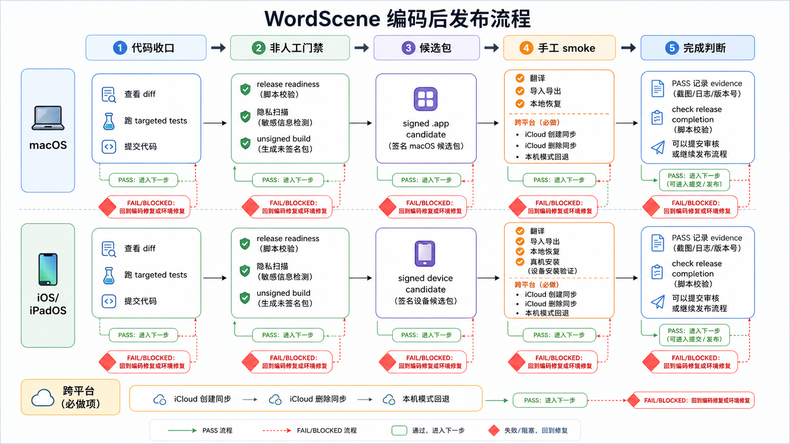

# WordScene 编码后发布流程

这份文档描述“代码已经改完之后”应该怎么把改动推进到可发布状态。目标是把编码、验证、候选包、真机 smoke、证据记录和最终完成判断拆开，避免把“构建通过”“候选包已生成”“人工 smoke 已通过”“可以提交审核”混成一件事。

适用范围：

- macOS signed candidate
- iOS / iPadOS signed device candidate
- 跨平台 iCloud 同步 smoke
- 本机模式和 local-only fallback 验证

## 流程总览

下图是视觉总览；具体命令和判断以本文正文为准。



## 角色分工

Agent 适合做：

- 查看 diff，确认改动范围没有混入无关文件。
- 跑 targeted tests、release readiness、candidate gate、live API smoke。
- 生成或刷新 `docs/release-smoke-evidence.md`。
- 安装 iOS candidate 到已连接真机。
- 根据脚本输出解释下一步应该做什么。
- 在失败时读日志、定位代码或环境问题。

用户必须亲自确认或明确授权的部分：

- 真机和 macOS App 的实际手工 smoke。
- Apple ID、iCloud、钥匙串、Xcode Accounts、设备信任等外部状态。
- App Store Connect 上传、提交审核、发布上线。
- 是否把某个人工场景记录为 `PASS`。不要让 Agent 在没有实际执行的情况下替你记录通过。

## 总流程

1. 代码收口。
2. 非人工 release readiness。
3. 提交代码。
4. signed candidate gate。
5. 刷新真实 DeepSeek live smoke 证据。
6. 安装 iOS / iPadOS candidate。
7. 运行 macOS 和 iOS / iPadOS 手工 smoke。
8. 用脚本记录人工 smoke 结果。
9. 跑 release completion。
10. completion 通过后，才进入上传、审核或发布动作。

## 1. 代码收口

先确认当前改动确实只属于这次需求：

```bash
git status --short
git diff --stat
git diff
```

如果改动包含无关文件，不要顺手一起提交。让 Agent 拆分提交，或者你自己决定哪些文件属于本次发布。

然后跑和改动相关的 targeted tests。例子：

```bash
xcodebuild test \
  -scheme WordScene \
  -destination 'id=<mac-or-device-id>' \
  -only-testing:WordSceneTests/AppDataControllerTests
```

结果处理：

| 结果 | 下一步 |
| --- | --- |
| PASS | 进入 release readiness。 |
| FAIL | 先修代码，不要进入 candidate。 |
| 编译失败 | 优先修 Swift 编译、签名或 destination 问题。 |
| 测试环境不可用 | 先跑 `xcodebuild -showdestinations -scheme WordScene` 确认 destination。 |

## 2. 非人工 Release Readiness

运行：

```bash
scripts/test_verify_release_readiness.sh
```

这个脚本覆盖脚本自测、`git diff --check`、Token 泄露扫描、隐私 manifest、required reason API、CloudKit background-mode、macOS 测试、iOS simulator 测试、generic iOS build 和 unsigned Release build。

结果处理：

| 结果 | 含义 | 下一步 |
| --- | --- | --- |
| `Release readiness checks passed for non-manual gates.` | 非人工门禁通过。 | 可以提交代码。 |
| shell test 失败 | 发布脚本自身有问题。 | 修脚本或测试，不要绕过。 |
| privacy / token scan 失败 | 可能有敏感信息或隐私声明缺口。 | 先修复再继续。 |
| xcodebuild 失败 | 代码、项目配置、签名或 simulator 环境有问题。 | 按日志修复；让 Agent 读 `.xcresult` 或 build log。 |

## 3. 提交代码

只提交产品代码、测试和必要文档，不要把 candidate evidence 混进同一个提交：

```bash
git add <changed-files>
git commit -m "<short imperative message>"
```

建议提交粒度：

- 产品代码一提交。
- candidate evidence 一提交。
- live smoke evidence 一提交。
- 人工 smoke evidence 一提交。

这样以后回滚或审计时不会分不清“代码变化”和“证据刷新”。

## 4. Candidate Gate

代码提交后运行：

```bash
scripts/run_release_candidate_gate.sh --allow-provisioning-updates --platform all
```

它会重新跑 readiness，构建 signed macOS candidate 和 signed iOS candidate，并把证据写入：

```text
docs/release-smoke-evidence.md
```

结果处理：

| 结果 | 下一步 |
| --- | --- |
| `Release candidate gate completed.` | 提交 candidate evidence。 |
| macOS signing 失败 | 看 `docs/release-signing-runbook.md`，先修 Xcode Account、Team、profile 或证书。 |
| iOS signing 失败 | 确认设备注册、Team ID、bundle id、profile、`--allow-provisioning-updates`。 |
| readiness 在 gate 内失败 | 回到第 2 步，不要记录人工 smoke。 |

提交 evidence：

```bash
git add docs/release-smoke-evidence.md
git commit -m "Refresh candidate evidence after <change>"
```

## 5. DeepSeek Live Smoke

候选包证据刷新后，跑真实 API smoke：

```bash
scripts/run_live_deepseek_translation_smoke.sh \
  --evidence docs/release-smoke-evidence.md
```

它读取本地忽略文件中的 DeepSeek token，不会把 token 打印进 evidence。

结果处理：

| 结果 | 下一步 |
| --- | --- |
| 返回 `PASS`，且翻译为 `你好世界` | 提交 live smoke evidence。 |
| token 缺失 | 配置 `.local/deepseek-token`，不要提交 token。 |
| API 返回结构变更 | 先修解析或 prompt，不要继续人工 smoke。 |
| 网络或服务失败 | 标记为环境问题；稍后重试或记录 BLOCKED。 |

提交 evidence：

```bash
git add docs/release-smoke-evidence.md
git commit -m "Refresh live smoke evidence after <change>"
```

## 6. macOS 流程

### 6.1 候选包位置

candidate gate 成功后，macOS candidate 默认在：

```text
/tmp/WordSceneReleaseCandidates/macOS/Build/Products/Release/Word Scene.app
```

local-only fallback 用到的 unsigned macOS Release app 默认在：

```text
/tmp/WordSceneVerifyReleaseMac/Build/Products/Release/Word Scene.app
```

### 6.2 macOS 手工 smoke

先看当前可记录行：

```bash
scripts/internal/manual_smoke_readiness.sh \
  --evidence docs/release-smoke-evidence.md \
  --commands \
  --summary \
  --scope macos
```

然后按 `docs/release-smoke-test.md` 跑：

- Translation loop / macOS
- Import/export / macOS
- Local recovery / macOS

记录通过示例：

```bash
scripts/internal/record_release_smoke_result.sh \
  --evidence docs/release-smoke-evidence.md \
  --area "Translation loop" \
  --platform "macOS" \
  --device "MacBook Pro / macOS 26.5" \
  --build "1" \
  --result "PASS" \
  --confirm-executed \
  --notes "Saved token, translated hello world, favorited result, history survived relaunch."
```

结果处理：

| 结果 | 怎么处理 |
| --- | --- |
| PASS | 记录 PASS，并写清设备、系统、关键验证点。 |
| FAIL | 记录 FAIL，保留复现步骤；回到编码修复。修完后重新跑 readiness 和 candidate gate。 |
| BLOCKED | 记录 BLOCKED，说明是环境、账号、网络、签名还是设备问题。 |
| 布局或交互问题 | 截图，交给 Agent 修 UI；修完重新走完整候选包链路。 |

## 7. iOS / iPadOS 流程

### 7.1 环境预检

运行：

```bash
scripts/internal/manual_smoke_environment_preflight.sh
```

重点看：

- iOS release candidate app 是否 `FOUND`
- physical iPhone / iPad 是否 `Available` 或 `connected`
- iOS / iPadOS device smoke 是否 `READY`

`READY` 不是 PASS。它只表示环境和 evidence 允许你去跑这个场景。

### 7.2 安装 candidate

如果有真机：

```bash
scripts/internal/install_ios_release_candidate.sh \
  --device <device-identifier>
```

如果不知道设备 id：

```bash
xcrun devicectl list devices
```

candidate 默认路径：

```text
/tmp/WordSceneReleaseCandidates/iOS/Build/Products/Release-iphoneos/Word Scene.app
```

### 7.3 iPhone / iPad 手工 smoke

查看可记录行：

```bash
scripts/internal/manual_smoke_readiness.sh \
  --evidence docs/release-smoke-evidence.md \
  --commands \
  --summary \
  --scope ios-device
```

按 `docs/release-smoke-test.md` 跑：

- Translation loop / iPhone
- Translation loop / iPad
- Import/export / iOS/iPadOS
- Local recovery / iOS/iPadOS

记录通过示例：

```bash
scripts/internal/record_release_smoke_result.sh \
  --evidence docs/release-smoke-evidence.md \
  --area "Translation loop" \
  --platform "iPhone" \
  --device "iPhone 17 Pro Max / iOS 26.0" \
  --build "1" \
  --result "PASS" \
  --confirm-executed \
  --notes "Saved token, translated hello world, favorited result, history survived relaunch."
```

结果处理：

| 结果 | 怎么处理 |
| --- | --- |
| PASS | 记录 PASS。iPhone 和 iPad 要分别记录。 |
| 真机不可用 | 不要用 simulator 冒充真机 smoke；记录 BLOCKED 或先修设备连接。 |
| 安装失败 | 检查 Developer Mode、设备信任、profile、Team、bundle id。 |
| App 启动后数据异常 | 先导出数据或截图，再让 Agent 查 Core Data / CloudKit 状态。 |
| 键盘、布局、触摸问题 | 截图并回到编码修复；修完必须重新出 candidate。 |

## 8. 跨平台 iCloud Smoke

iCloud smoke 需要至少两个 signed candidate 环境，推荐 iPhone + macOS，同一个 Apple ID。

先确认可记录行：

```bash
scripts/internal/manual_smoke_readiness.sh \
  --evidence docs/release-smoke-evidence.md \
  --commands \
  --summary \
  --scope cross-platform
```

必须跑：

- iCloud create sync / iPhone + macOS
- iCloud delete sync / iPhone + macOS

当前产品策略是 iCloud 同步 opt-in，所以 smoke 前要确认两端都打开“使用 iCloud 同步”，并重启 App 让 CloudKit-backed store 生效。

记录示例：

```bash
scripts/internal/record_release_smoke_result.sh \
  --evidence docs/release-smoke-evidence.md \
  --area "iCloud create sync" \
  --platform "iPhone + macOS" \
  --device "iPhone 17 Pro Max / iOS 26.0 + MacBook Pro / macOS 26.5" \
  --build "1" \
  --result "PASS" \
  --confirm-executed \
  --notes "Created and favorited item on iPhone; item appeared in macOS Library and Search after CloudKit event."
```

结果处理：

| 结果 | 怎么处理 |
| --- | --- |
| PASS | 记录 create 和 delete 两行 PASS。 |
| `CKErrorDomain error 2` | 看设置页展开后的底层错误。`error 2` 只是 partial failure 壳，不是根因。 |
| 一端未打开同步 | 打开 opt-in，重启 App，再重试。 |
| Apple ID 或 iCloud Drive 异常 | 先修系统账号状态，不要改代码。 |
| 数据迟迟不同步 | 等待系统同步；查看 Settings 同步事件。可以先记录 BLOCKED，不要假 PASS。 |

## 9. Local-Only Fallback

local-only fallback 需要 signed iOS candidate 和 unsigned macOS Release app。

查看可记录行：

```bash
scripts/internal/manual_smoke_readiness.sh \
  --evidence docs/release-smoke-evidence.md \
  --commands \
  --summary \
  --scope local-only
```

记录示例：

```bash
scripts/internal/record_release_smoke_result.sh \
  --evidence docs/release-smoke-evidence.md \
  --area "Local-only fallback" \
  --platform "macOS/iOS" \
  --device "Unsigned Mac Release + iPhone 17 Pro Max / iOS 26.0" \
  --build "1" \
  --result "PASS" \
  --confirm-executed \
  --notes "Local-only mode was explicit; created, searched, deleted local items; data survived relaunch."
```

如果这个场景失败，不要把它当成小问题。local-only 是用户没有开启 iCloud、无 entitlement、网络异常或账号异常时的保底路径，必须可用。

## 10. 完成判断

所有人工 smoke 记录后运行：

```bash
scripts/check_release_completion.sh
```

结果处理：

| 结果 | 含义 | 下一步 |
| --- | --- | --- |
| 退出码 0 | release evidence 完整。 | 可以进入上传、审核或发布动作。 |
| `Missing PASS evidence` | 有手工 smoke 没跑或没记录。 | 跑对应场景并记录。 |
| candidate commit 过旧 | 代码变了但 candidate 没刷新。 | 重新跑 candidate gate。 |
| live smoke commit 过旧 | API smoke 证据不对应当前状态。 | 重新跑 live smoke。 |

## 11. 让 Agent 怎么参与

你可以直接让 Agent 做：

```text
现在代码改完了，按 docs/post-code-release-workflow.md 跑到 candidate 安装为止，不要提交 App Store。
```

或者：

```text
我已经手工跑完 iPhone translation smoke，这是设备和结果，请帮我记录 evidence。
```

不要让 Agent 做：

```text
没跑但先帮我记 PASS。
```

这会污染 release evidence。更正确的做法是记录 `BLOCKED` 或先不记录。

## 12. 常见分叉

| 场景 | 判断 | 处理 |
| --- | --- | --- |
| 编译或测试失败 | 代码问题优先。 | 回编码修复，重新从 readiness 开始。 |
| 签名失败 | 环境或 Apple Developer 配置问题。 | 按 `docs/release-signing-runbook.md` 修，不要乱改 bundle id。 |
| 只有 simulator 可用 | 不满足真机 smoke。 | 可以做 UI 预查，但不能记录 iPhone/iPad PASS。 |
| iCloud 同步失败 | 先看展开后的底层 CloudKit 错误。 | 区分账号、网络、schema、quota、权限，再决定修环境还是代码。 |
| evidence 只差人工行 | 构建没坏。 | 按 `manual_smoke_session_guide.sh` 跑对应 checklist。 |
| 完成检查仍失败 | evidence 不完整或已过期。 | 按脚本输出补齐，不要手改表格骗过检查。 |

## 13. 最短命令序列

编码完成后，Agent 或你自己通常按这个序列执行：

```bash
git status --short
git diff --stat

scripts/test_verify_release_readiness.sh

git add <changed-files>
git commit -m "<code change>"

scripts/run_release_candidate_gate.sh --allow-provisioning-updates --platform all
git add docs/release-smoke-evidence.md
git commit -m "Refresh candidate evidence after <change>"

scripts/run_live_deepseek_translation_smoke.sh --evidence docs/release-smoke-evidence.md
git add docs/release-smoke-evidence.md
git commit -m "Refresh live smoke evidence after <change>"

scripts/manual_smoke_session_guide.sh

# 手工执行 docs/release-smoke-test.md 中对应场景后，再记录 PASS/FAIL/BLOCKED。
scripts/check_release_completion.sh
```

只有 `scripts/check_release_completion.sh` 通过，才应该说这轮 candidate 已经完成发布前验证。
