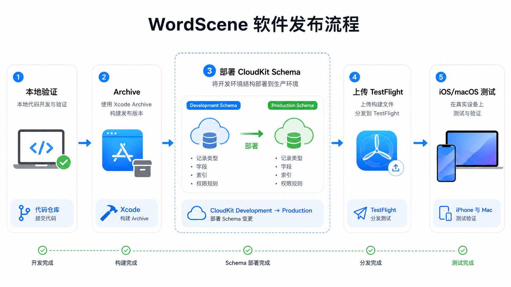
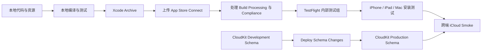
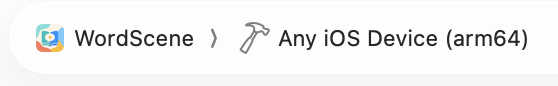
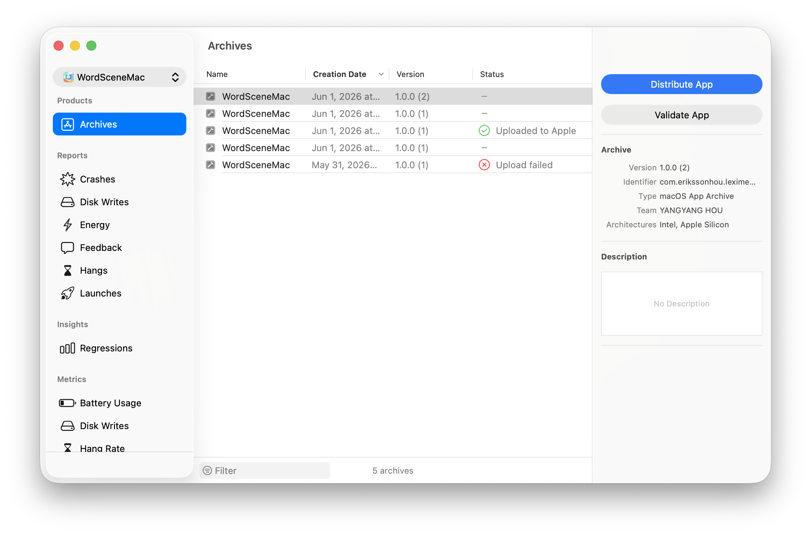
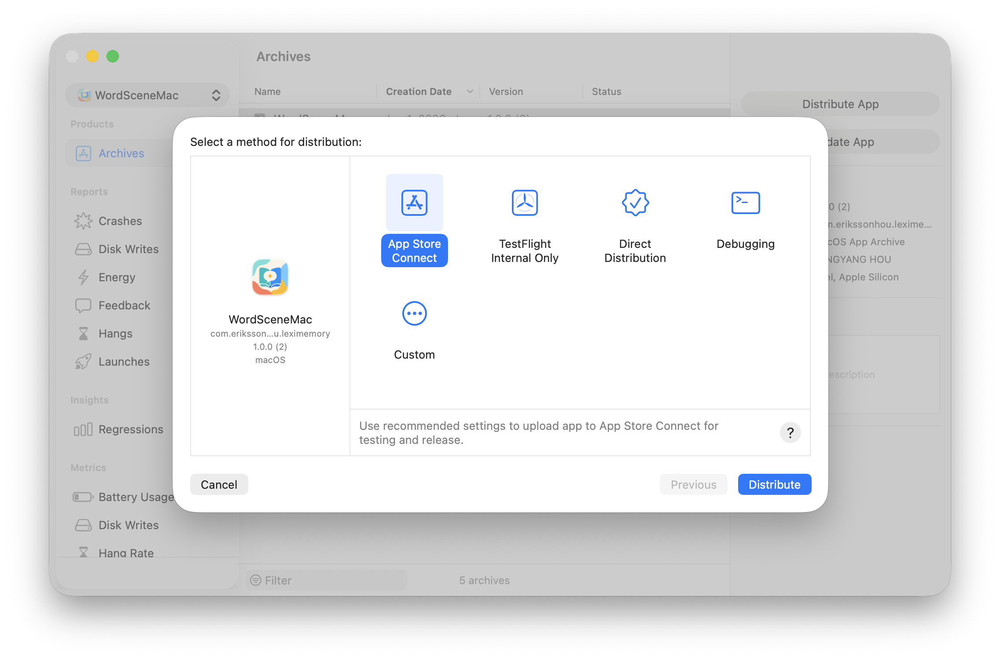
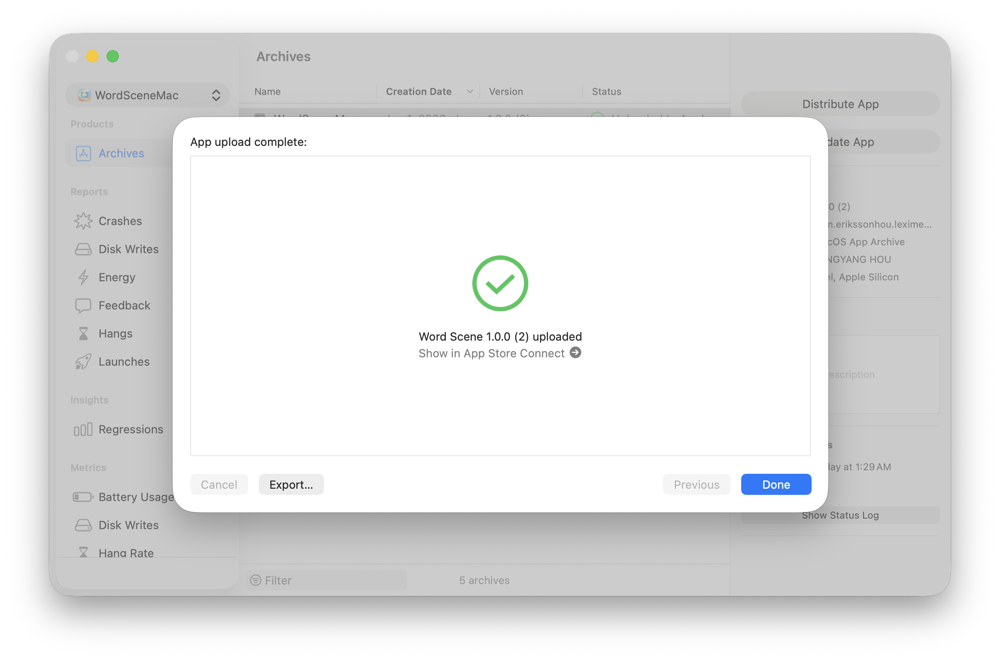
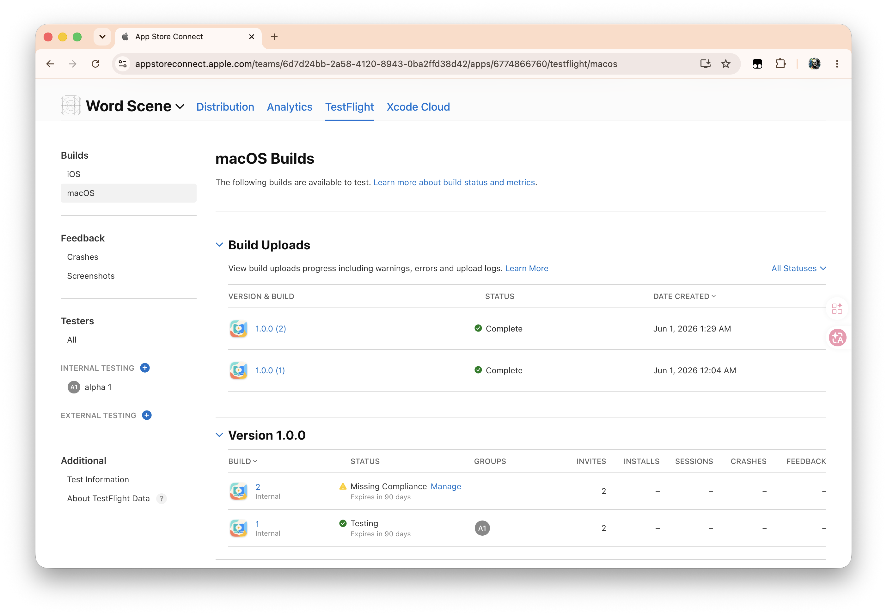
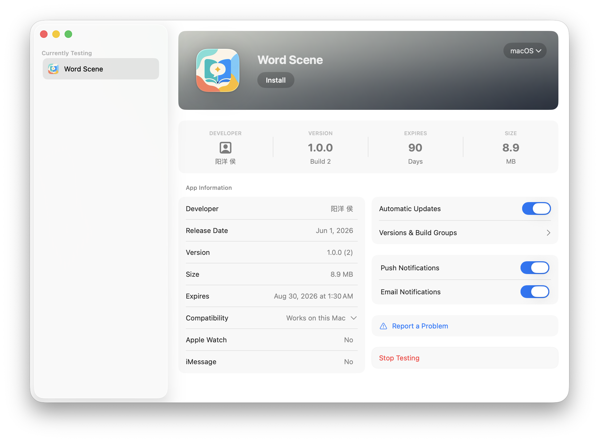
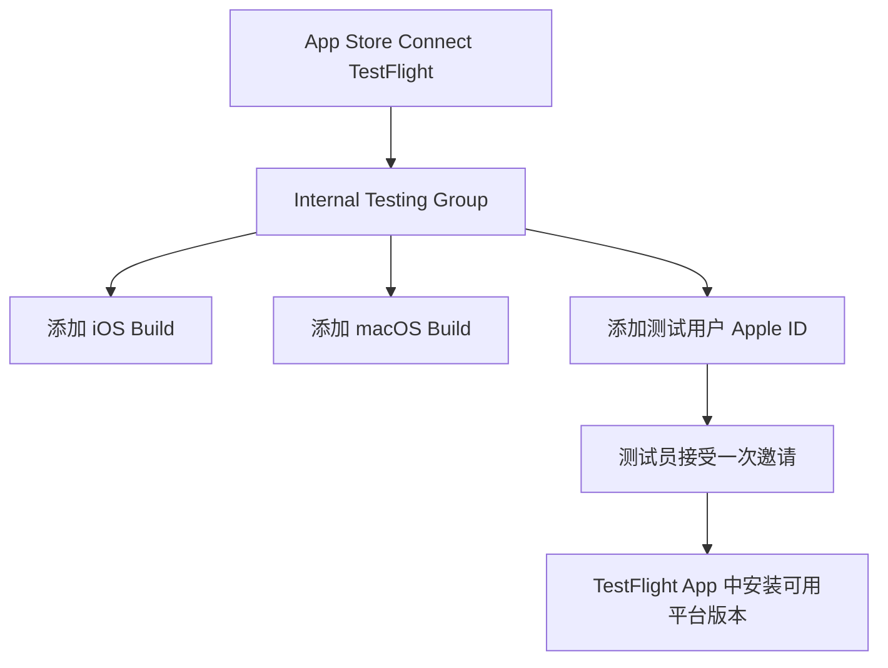
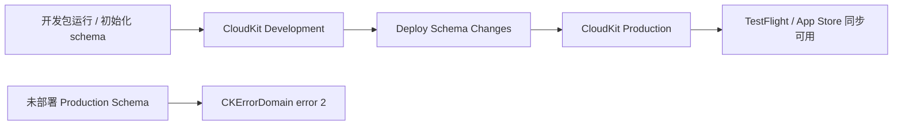

# WordScene 软件部署指南

本文档记录 WordScene 发布到 TestFlight / App Store Connect 的标准步骤，覆盖 iOS/iPadOS 与 macOS 两个平台。

> 关键原则：能在本地真机运行，不等于能发 TestFlight。TestFlight 使用正式分发链路，必须同时检查签名、entitlements、Build Number、CloudKit Production schema、加密合规和上线后 smoke test。

## 1. 发布总览





## 2. 发布前检查清单

每次上传前先检查以下项目，不要跳过：

- 当前代码改动已确认，工作区没有未理解的脏改动。
- iOS/iPadOS scheme 使用 `WordScene`。
- macOS scheme 使用 `WordSceneMac`。
- iOS/iPadOS Archive destination 使用 `Any iOS Device (arm64)`。
- macOS Archive destination 使用 `Any Mac (arm64, x86_64)`。
- `Version` 确认，例如 `1.0.0`。
- `Build Number` 每次上传递增。
- Bundle ID 保持 `com.erikssonhou.leximemory`。
- iCloud container 保持 `iCloud.com.erikssonhou.leximemory`。
- DeepSeek API Token 不进入仓库、不进入导出文件、不进入 CloudKit。
- iOS 与 macOS App Icon 都已确认是最新资源。
- macOS App Store sandbox entitlement 已启用。
- CloudKit Development schema 已部署到 Production。

## 3. 本地编译和测试

### XcodeGen 工程生成

WordScene 的 Xcode 工程由 `project.yml` 通过 XcodeGen 生成。`project.yml` 是工程蓝图，负责定义项目名、全局构建设置、iOS/macOS app target、测试 target、scheme、Bundle ID、Info.plist 生成项、entitlements、资源目录、App Icon 生成脚本等。

当前工程的关键配置包括：

- iOS app target：`WordScene`
- macOS app target：`WordSceneMac`
- 共享源码目录：`WordScene/Sources/Shared`
- 共享资源目录：`WordScene/Resources`
- Bundle ID：`com.erikssonhou.leximemory`
- iCloud container：`iCloud.com.erikssonhou.leximemory`
- 显示名称：`译笺`
- 主要测试 scheme：`WordScene`、`WordSceneMac`、`WordSceneCloudKitSchema`、`WordSceneMacCloudKitSchema`

修改 target、scheme、签名、entitlements、资源、测试目标、Build Settings 等工程结构时，优先修改 `project.yml`，然后在项目根目录重新生成 Xcode project：

```bash
cd /Users/erikssonhou/Documents/WordScene
xcodegen generate
```

生成结果会更新 `WordScene.xcodeproj`。如果只在 Xcode 里手工修改 `.xcodeproj`，但没有同步回 `project.yml`，下一次执行 `xcodegen generate` 时这些手工改动可能被覆盖。

发布前尤其注意：

- `CURRENT_PROJECT_VERSION` 必须随每次 TestFlight 上传递增，不能低于 App Store Connect 已存在的同版本 build。
- Bundle ID 和 iCloud container 已绑定 App Store Connect、签名与 CloudKit，除非明确迁移计划，不要随意更名。
- `project.yml` 和 `WordScene.xcodeproj` 不应长期分叉；修改工程配置后要确认生成后的 `.xcodeproj` 与预期一致。
- `WordScene/Resources`、Info.plist 自动生成项、App Icon post-build script 等配置变更后，需要至少跑一次本地构建确认资源和签名产物没有偏差。

发布前至少跑一轮本地验证：

```bash
scripts/test_verify_release_readiness.sh
```

如果只想快速确认 Xcode 构建链路，可以分别构建：

```bash
xcodebuild build \
  -project WordScene.xcodeproj \
  -scheme WordScene \
  -destination 'generic/platform=iOS'

xcodebuild build \
  -project WordScene.xcodeproj \
  -scheme WordSceneMac \
  -destination 'platform=macOS,arch=arm64'
```

本地验证失败时不要继续上传。先修复构建、测试、签名或资源问题。

## 4. Build Number 规则

App Store Connect 不允许同一个 `Version` 下重复上传相同 `Build Number`。

示例：

| 已上传 | 下一次上传应使用 |
| --- | --- |
| `1.0.0 (1)` | `1.0.0 (2)` |
| `1.0.0 (2)` | `1.0.0 (3)` |
| `1.0.1 (1)` | `1.0.1 (2)` |

如果只是修复 TestFlight 问题，`Version` 可以不变，只把 `Build Number` 加 1。

Xcode 中修改位置：

`Target -> General -> Identity -> Build`

或 Build Settings：

`CURRENT_PROJECT_VERSION`

## 5. iOS/iPadOS Archive

在 Xcode 中打开 `WordScene.xcodeproj`。

选择：

- Scheme：`WordScene`
- Destination：`Any iOS Device (arm64)`



然后执行：

`Product -> Build`

确认构建通过后执行：

`Product -> Archive`

Archive 成功后会打开 Organizer。



## 6. macOS Archive

在 Xcode 中打开 `WordScene.xcodeproj`。

选择：

- Scheme：`WordSceneMac`
- Destination：`Any Mac (arm64, x86_64)`


然后执行：

`Product -> Build`

确认构建通过后执行：

`Product -> Archive`

## 7. macOS Sandbox 检查

macOS TestFlight / Mac App Store 分发必须开启 App Sandbox。否则上传会失败，例如：

```text
App sandbox not enabled.
The following executables must include the "com.apple.security.app-sandbox"
entitlement with a Boolean value of true.
```

当前 macOS target 需要这些 entitlement：

```text
com.apple.security.app-sandbox = true
com.apple.security.network.client = true
com.apple.security.files.user-selected.read-write = true
```

原因：

- `app-sandbox`：Mac App Store 强制要求。
- `network.client`：DeepSeek 翻译请求与 CloudKit 同步需要联网。
- `files.user-selected.read-write`：导入/导出需要读写用户选择的文件。

配置位置：

- `project.yml`
- `WordScene/WordSceneMac.entitlements`

如果修改了 `project.yml`，必须重新生成 Xcode project：

```bash
xcodegen generate
```

可用下面命令检查最终签名的 app 是否包含 sandbox：

```bash
codesign -d --entitlements :- \
  ~/Library/Developer/Xcode/DerivedData/WordScene-*/Build/Products/Release/Word\ Scene.app
```

输出中必须有：

```text
com.apple.security.app-sandbox = true
```

## 8. 上传到 App Store Connect

在 Organizer 中选择 Archive：

`Distribute App -> App Store Connect`



目前仅作为内部测试时，选择：

`TestFlight Internal Only`

然后点击 `Distribute`。



上传成功后进入 App Store Connect：

<https://appstoreconnect.apple.com>



## 9. Build Processing 和 Compliance

上传成功不代表马上能测试。需要等待 App Store Connect 处理 build：

1. 进入 `Apps -> WordScene -> TestFlight`。
2. 等 build 从 `Processing` 变成可选状态。
3. 处理 `Missing Compliance`。
4. 将 build 加入内部测试组。



关于加密合规：

- App 使用 HTTPS/TLS 网络请求。
- App 使用 Keychain 保存 API Token。
- App 使用 CryptoKit 做导出文件 checksum。
- App 不是自研加密产品。

填写时不要随手选“没有加密”。应按照 App Store Connect 当前 Export Compliance 问卷如实选择。通常这类使用系统标准加密能力的 App 会走标准加密/豁免路径，但最终以 Apple 问卷为准。

## 10. TestFlight 测试组



注意：

- 不需要为了 macOS 重新创建测试组。
- iOS 与 macOS build 可以加入同一个内部测试组。
- 测试员接受过邀请后，通常不需要重新接受。
- 新 build 一般会在 TestFlight App 内显示更新，不一定重新发送邀请邮件。
- 如果测试员看不到版本，先检查 build 是否已经加入测试组。

## 11. CloudKit Schema 部署

这是 iCloud 同步上线前最容易漏掉的步骤。

Debug / 开发包通常使用 CloudKit Development 环境。TestFlight / App Store 包使用 CloudKit Production 环境。Production 不会自动拥有 Development 的 schema。

首次 TestFlight 或 Core Data 模型变化后，必须把 Development schema 部署到 Production。



操作路径：

1. 打开 CloudKit Console：<https://icloud.developer.apple.com>
2. 选择容器：`iCloud.com.erikssonhou.leximemory`
3. 确认左上角环境为 `Development`
4. 左侧查看：
   - `Schema -> Record Types`
   - `Schema -> Indexes`
   - `Schema -> Security Roles`
5. 点击左下角 `Deploy Schema Changes...`
6. 确认部署到 Production
7. 等几分钟后再测试 TestFlight

如果 TestFlight 版本出现：

```text
Sync Error
CKErrorDomain error 2
```

优先检查 Production schema 是否已经部署。不要第一时间改同步代码。

注意：部署 schema 只复制结构，不复制 Development 环境里的测试数据。

## 12. TestFlight 安装和邀请

测试员安装步骤：

1. iPhone / Mac 安装 TestFlight。
2. 使用被加入测试组的 Apple ID 登录。
3. 打开邀请邮件，点击 `View in TestFlight` 或 `Accept Invitation`。
4. 在 TestFlight 中点击 `Accept`。
5. 安装对应平台 build。

如果收不到邀请：

- 确认测试员邮箱就是 TestFlight 登录的 Apple ID。
- 确认测试组里已经添加测试员。
- 确认测试组里已经添加 build。
- 确认 build 已完成 Processing。

## 13. 发布后 Smoke Test

每个 TestFlight build 上传后至少执行下面的 smoke test。

| 测试项 | iOS | macOS | 预期 |
| --- | --- | --- | --- |
| 安装启动 | 必测 | 必测 | App 正常打开 |
| 保存 DeepSeek Token | 必测 | 必测 | Token 只保存在本机 |
| Test Connection | 必测 | 必测 | 返回成功 |
| 自动检测翻译 | 必测 | 可测 | `Hola -> 中文` 可翻译 |
| 收藏页语言方向 | 必测 | 必测 | 显示检测语言，例如 `西班牙语 -> 中文` |
| 收藏新增 | 必测 | 必测 | 本机可见 |
| 收藏删除 | 必测 | 必测 | 本机消失 |
| iCloud 新增同步 | 必测 | 必测 | 同 Apple ID 跨端出现 |
| iCloud 删除同步 | 必测 | 必测 | 同 Apple ID 跨端消失 |
| 导入导出 | 可测 | 必测 | 用户选择文件读写正常 |
| macOS 图标 | 不适用 | 必测 | Finder/Dock 显示新图标 |

iCloud smoke 条件：

- iPhone 和 Mac 使用同一个 Apple ID。
- iCloud Drive 可用。
- 两端都安装 TestFlight build。
- 两端都打开 `Use iCloud Sync`。
- 不承诺实时同步，等待 30 秒到几分钟是正常的。

## 14. 常见错误

| 错误 | 可能原因 | 处理 |
| --- | --- | --- |
| Build number 已存在 | 同版本下重复上传同一 Build | Build Number 加 1 后重新 Archive |
| Missing Compliance | 加密合规未填写 | App Store Connect 中处理 Export Compliance |
| App sandbox not enabled | macOS entitlements 缺 sandbox | 添加 `com.apple.security.app-sandbox = true` |
| CKErrorDomain error 2 | CloudKit Production schema 未部署或局部失败 | 先部署 CloudKit schema 到 Production |
| TestFlight 看不到新版本 | Build 未加入测试组或还在 Processing | 等处理完成并把 build 加入测试组 |
| 邀请没收到 | 邮箱/Apple ID 不一致或未加入组 | 检查测试员 Apple ID 和测试组 |
| macOS 图标没变化 | Finder/Dock 缓存或 `.icns` 不完整 | clean build，确认完整 `AppIcon.icns`，必要时重启 Dock/Finder |

## 15. 重新上传和回滚规则

- 已上传的 build 不能覆盖。
- 修复后重新上传必须递增 Build Number。
- 不想继续分发某个 build 时，在 App Store Connect 中停止测试或不加入测试组。
- 不要为了一个新 macOS build 重新创建测试组，除非确实要分开管理 iOS 与 macOS 测试人群。
- TestFlight 问题修复完成后，先跑 smoke test，再扩大测试范围。
